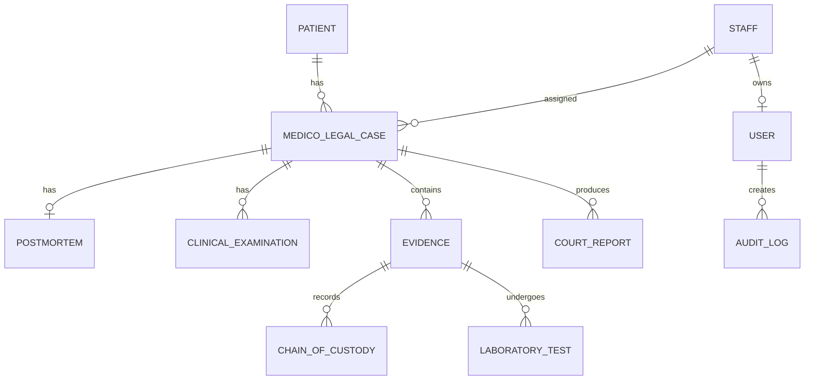

# Database Design

## Conceptual ER model

## Relational schema

- STAFF(**staff_id**, full_name, role, specialization, contact_no, email)
- USERS(**user_id**, *staff_id*, username, password_hash, full_name, user_role, is_active)
- PATIENTS(**patient_id**, full_name, nic, age, gender, address, contact_no, hospital_bht, ward)
- MEDICO_LEGAL_CASES(**case_id**, case_number, *patient_id*, case_type, incident_date, incident_location, police_station, description, *assigned_staff_id*, status)
- POSTMORTEMS(**postmortem_id**, *case_id*, examination_date, findings, cause_of_death, remarks, *performed_by*)
- CLINICAL_EXAMINATIONS(**examination_id**, *case_id*, examination_date, injuries, findings, recommendation, *examined_by*)
- EVIDENCE(**evidence_id**, evidence_code, *case_id*, evidence_type, description, storage_location, collected_date, *collected_by*, current_status)
- CHAIN_OF_CUSTODY(**custody_id**, *evidence_id*, *from_staff_id*, *to_staff_id*, transfer_date, purpose, remarks)
- LABORATORY_TESTS(**test_id**, *evidence_id*, test_type, result, *tested_by*, test_date, status)
- COURT_REPORTS(**report_id**, *case_id*, report_type, *prepared_by*, submission_date, court_name, status, remarks)
- AUDIT_LOGS(**audit_id**, *user_id*, action, table_name, record_id, details, created_at)

Bold fields are primary keys; italic fields are foreign keys. The design is in third normal form: repeating examinations, evidence transfers, tests, and reports are separated from the case; staff facts are stored once; and non-key attributes depend on their table's key.

## Key business rules

- A patient can have many medico-legal cases; every case belongs to one patient.
- A case can have many clinical examinations, evidence items, and court reports.
- An autopsy case has at most one postmortem record.
- Evidence transfers form an append-only chain-of-custody history.
- Age is limited to 0–130, identifiers are unique, required fields are `NOT NULL`, and foreign keys prevent orphan records.
- Submitted/approved court reports must contain a court and submission date.
- Operational API endpoints require a valid JWT; destructive laboratory actions and audit access are role restricted.
